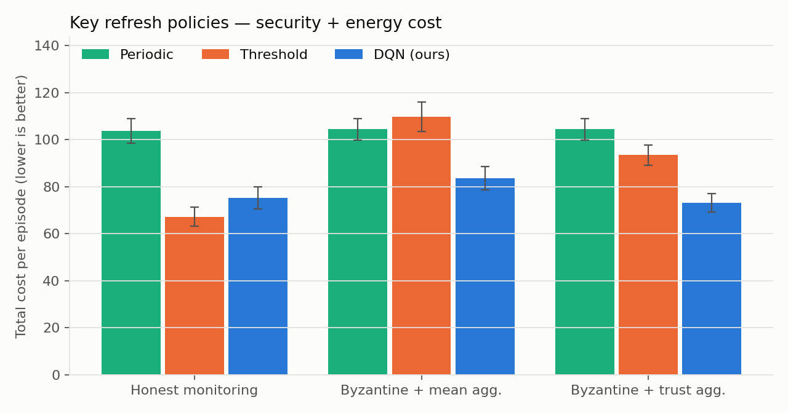
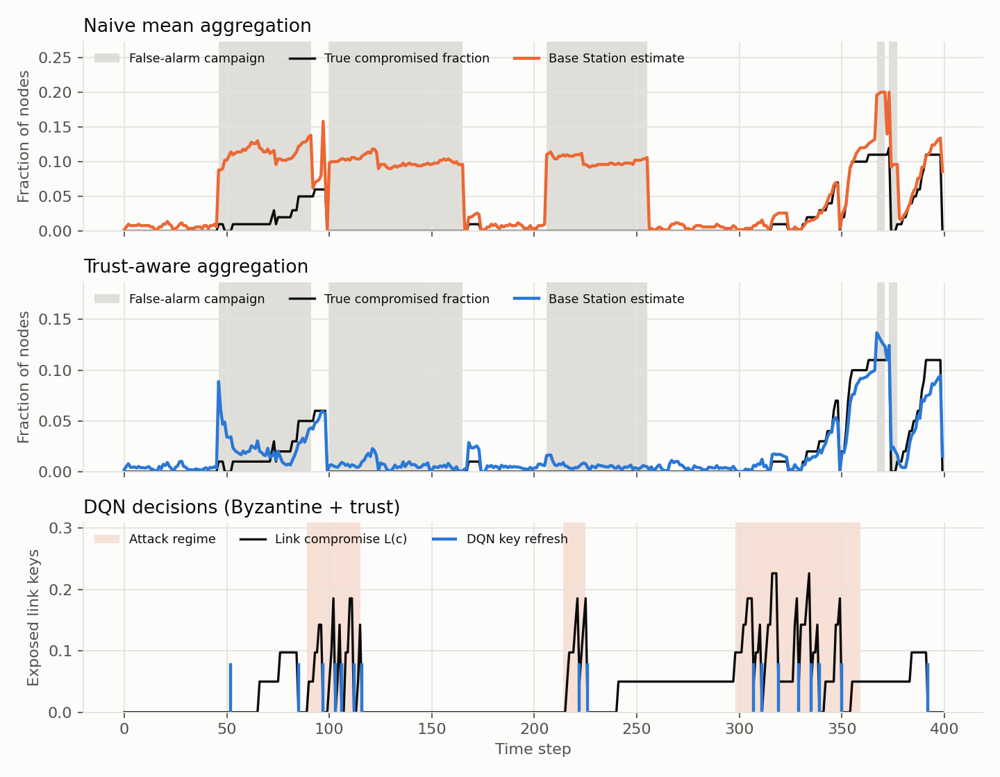

# Adaptive Key Refresh for IoT Networks with Deep Reinforcement Learning

A Deep Q-Network agent at the Base Station of a wireless sensor network decides **when to refresh the network's symmetric keys**. It has to balance two costs:

- **Security.** Captured nodes leak their keys, so every step without a refresh leaves more link keys exposed.
- **Energy.** Every refresh drains the batteries of constrained IoT nodes.

The project also addresses **Byzantine monitoring**: compromised nodes send false security metrics to mislead the agent. It evaluates a **trust-aware aggregation layer** (Beta reputation) that filters out those false metrics, and **event-driven reporting**, which cuts monitoring overhead.

<p align="center"></p>

## Key results
Numbers come from 50 unseen test episodes of 1000 steps each. Baselines are tuned by grid search for each scenario. Full table: [`results/results.md`](results/results.md).

| Scenario | Periodic (tuned) | Threshold (tuned) | **DQN** |
|---|---|---|---|
| Honest monitoring | 103.8 | **67.3** | 75.3 |
| Byzantine nodes + naive mean aggregation | 104.5 | 109.8 | **83.7** |
| Byzantine nodes + trust-aware aggregation | 104.5 | 93.4 | **73.1** |

*Total cost = link-compromise cost + energy cost, lower is better.*

- **With Byzantine nodes, the DQN reduces total cost by about 20%** compared with the best tuned baseline.
- **Trust-aware aggregation divides the estimation error by 4** (MAE 0.031 → 0.0075). With it, the DQN runs almost as well as with honest monitoring (73.1 vs 75.3).
- **Event-driven reporting sends 99.2% fewer monitoring messages** (500,000 → 3,842 per episode) and delivers the same information to the Base Station.
- **An honest limitation:** with honest monitoring, a well-tuned threshold heuristic still beats the DQN. The benefit of learning shows up when the security metrics are noisy or adversarial.

<p align="center"></p>

*Top two panels: during a false-alarm campaign by malicious insiders (grey), naive averaging reports about 10% of nodes compromised when none are, while trust-aware aggregation stays close to the truth. Bottom panel: the DQN refreshes keys rarely in calm periods and often during attack bursts (orange).*

## Model

```
 Adversary (Markov-modulated Poisson captures: calm 0.02 / attack 0.6 nodes per step)
        │ captures nodes → learns their key rings (RKP)
        ▼
 ┌──────────── IoT network: 100 nodes, 5 watchdogs per node ────────────┐
 │ honest watchdogs: detection delay + false alarms                     │
 │ Byzantine watchdogs: hide compromised peers, frame honest nodes      │
 │ insiders: intermittent false-alarm campaigns (energy-drain attack)   │
 └──────────────────────────────┬───────────────────────────────────────┘
                                │ event-driven reports
                                ▼
 Base Station ── aggregation (mean | majority | Beta-trust) ──► state s_t ──► DQN ──► {wait, refresh}
```

| Component | Choice |
|---|---|
| Key management | Random Key Predistribution (Eschenauer & Gligor, 2002): pool 1000, ring 50, link exposure `L(c) = 1 − (1 − k/P)^c` |
| Healing | Mobile-adversary self-healing (POSH-like): a refresh makes the adversary's keys obsolete |
| State (6-D) | estimated compromised fraction, fast and slow EMAs, time since last refresh, battery, time remaining |
| Reward | `r = −L(c_t) − E_t / E_refresh` (one refresh costs 1) |
| Agent | Double DQN, MLP 128×128, replay buffer 100k, soft target update τ = 0.01, ε-greedy, Huber loss, best checkpoint selected on validation seeds |
| Robust aggregation | Beta reputation (Jøsang & Ismail, 2002) with a forgetting factor and asymmetric evidence |

## Repository structure
```
akr/
  env.py           # Gymnasium environment (WSN, adversary, watchdogs, energy)
  aggregation.py   # mean / majority / trust-aware aggregation
  dqn.py           # Double DQN agent (PyTorch)
  baselines.py     # periodic and threshold policies
scripts/
  train.py         # train one DQN per scenario
  evaluate.py      # tune baselines, benchmark, figures, results.md
tests/             # pytest unit tests
results/           # trained models, CSV logs, figures, tables
```

## Reproduce
```bash
pip install -r requirements.txt
pytest -q
for s in honest byzantine-mean byzantine-trust; do
  python scripts/train.py --scenario $s --episodes 400
done
python scripts/evaluate.py
```
Training takes about 15 minutes per scenario on a laptop CPU. All seeds are fixed: training 0–399, validation 7000–7009, baseline tuning 5000–5019, test 10000–10049.

## Limitations and next steps
- **Abstract simulation.** There is no radio, routing or real topology. Next step: port the model to NS-3 or Cooja/Contiki with measured energy costs.
- **Fixed reward weights.** Next step: learn the security/energy trade-off from data or by multi-objective RL (dynamic threat weighting).
- **Single key scheme (RKP).** Next step: extend to hierarchical and vector-based schemes such as EVKMS.
- **Non-adaptive adversary.** Next step: an adversarial RL attacker that learns to evade the agent.
- **Trust needs honest majorities.** If most watchdogs of a node lie, consensus breaks down. Next step: combine trust with Base-Station-side observations.


## License
MIT
